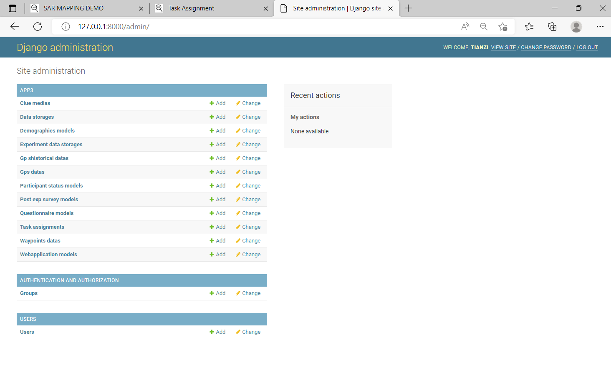

# Online Index (Updated 02/2024)
http://127.0.0.1:8000

# LEESH Web User Interface Demo (Updated 01/2024)

## Built based on
- DJango as server
- ESRI js development platform,
- d3 for polygon and voronoi.
- SQLite as database
- DJango REST framework is needed


# Experiment flow:


# Admin database page:
http://127.0.0.1:8000/admin
Create user: `python manage.py createsuperuser`

## Waypoint data:
Waypointsdata:
 -------------------------------------------
Windows setup
- db: change __init__.py -> use pymysql

Linux setup
- db: change __init__.py -> use mysqlclient

# Main demo page:


Reference
[ESRI Javascript API](https://developers.arcgis.com/javascript/latest/api-reference/esri-views-View.html#width)

URL
http://127.0.0.1:8000/app3/
 -------------------------------------------
If the migration sends errors, try:
- delete all tables in the db.sqlite3
- delete the migration folders
- manage.py makemigrations users
- manage.py migrate users

- manage.py makemigrations
- manage.py migrate

- manage.py makemigrations app3
- manage.py migrate app3

- manage.py createsuperuser
Enter username
Enter password
The username and password will be used to post/update gpsdatas.

New:
- Home page for sign up : http://127.0.0.1:8000
- admin page for user management:  http://127.0.0.1:8000/admin

 -------------------------------------------
1. Setup
[Django REST framework](https://www.django-rest-framework.org/tutorial/quickstart/)

pip install djangorestframework

In settings:

INSTALLED_APPS = [
    ...
    'rest_framework',
    ...
]

2. Stream GPS data to database:

Step 1) Post a new device

Step 2) Update GPS data

Code in python:  
```python
import requests

# create a new device, deviceis is the primary key
r = requests.post('http://127.0.0.1:8000/app3/gpsdatas/',auth=('username','password'), data = {'deviceid':'max_testing', 'taskid':'sar_put2','gpsdata':'{"gps":["stamp":4,"long":-81,"lat":37]}'})

# update record based on primary key. For example: "./max_testing/" is added as pk
r = requests.patch('http://127.0.0.1:8000/app3/gpsdatas/max_testing/', auth=('username','password'), data = {'deviceid':'max_testing', 'taskid':'sar_put2','gpsdata':'{"gps":["stamp":4,"long":-80,"lat":38]}'})
```

3. Operate in browser:
Open the link in chrome: http://127.0.0.1:8000/app3/gpsdatas/


